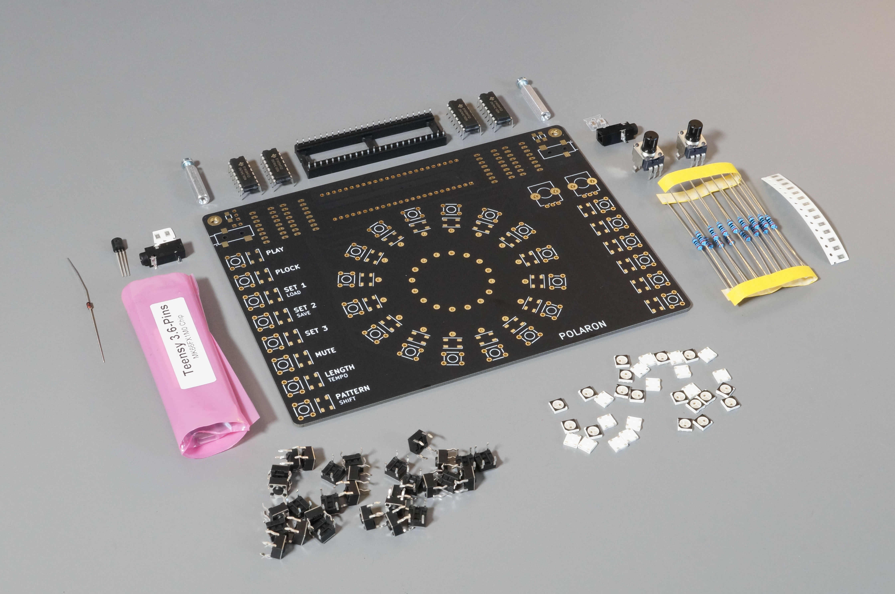

# Polaron

Polaron is a DIY digital drum machine based on the [Teensy 3.6](https://www.pjrc.com/teensy/) USB Microcontroller plattform.

Main features:

- 16 step sequencer
- 6 instrument tracks
- 16 patterns per track
- load/save projects to SD card
- 2 pots for parameter control
- parameter locks: all instrument parameters can be recorded for each step
- different pattern length for each instrument track
- midi sync / trigger input
- crunchy 12bit stereo outputs
- open source hardware/software: if you miss a feature or are annoyed by a bug... change it!

Disclaimer: This project is a work in progress. Features may change or not work, use at your own risk.

here's some short videos:

https://www.youtube.com/watch?v=JC_pZTxMb0c

https://vimeo.com/302283771

https://vimeo.com/305113707

Follow the project on Instagram: https://www.instagram.com/polaron.me/

And don't forget to check the [Project WIKI](https://github.com/zueblin/Polaron/wiki) for more info.

## Software

To build the software, the following tools are required:

- [Arduino IDE](https://www.arduino.cc/en/Main/Software) (tested with 1.8.6)
- [Teensyduino Add-On](https://www.pjrc.com/teensy/teensyduino.html) (tested with 1.43)

## Hardware

PCB is designed using KICAD 5.1.2

Parts needed (Rev 1.4):

- Teensy 3.6 32bit Microcontroller (with Headers)
- 30 x WS2812b RGB LEDs (or SK6812)
- 30 x 6x6mm Pushbuttons (ideally 4.3mm height, 100gf) (Mouser: 688-SKHHAJ)
- 16 x 270 ohm throughhole Resistors (Mouser: 603-MF0207FTE52-270R)
- 14 x 270 ohm SMD Resistors (1206 housing)
- 2 x 10k SMD Resistors (1206 housing)
- 1 x 1N4148 diode
- 1 x 2N3904BU transistor
- 4 x SN74HC165N Shiftregister (Mouser: 595-SN74HC165N)
- 2 x ALPS Potentiometer (RK09K1130A8G)
- 2 x 2.2 uF SMD Capacitor (1206 housing, Mouser: 963-TMK316BJ225KL-T)
- 2 x Audio Jack (SJ-352X-SMT)
- 1 x 48 Position / 2 Row IC DIP Socket (Mouser: 517-4848-6004-CP)
- 2 x 20mm PCB Standoff with 3mm thread (Mouser: 534-24437)

Check the Wiki for [Build Instructions](https://github.com/zueblin/Polaron/wiki/Building-the-Polaron)

## Known Issues:
PCB Rev 1.4

- In some situations, when connecting the polaron to a computer via usb and connecting the polaron audio output to an audio interface that is connected to the computer (e.g via thunderbolt), a ground loop is created. This results in a very noticable noise/whine in the audio channel (which is caused by the LED PWM). Tested solution: [Audio Ground Loop Noise Isolator](https://www.pjrc.com/store/audio_ground_isolator.html)

## FAQ

- Q: Is this an easy build? A: This is an intermediate project to build, its not particularly hard, but its not a good project if you've never soldered before. You need to be comfortable soldering surface mount parts (SMD). For this you need a decent soldering iron, with a rather fine tip.
- Q: Is this a pro audio project? A: No, not exactly. The Polaron is more about a fun workflow than super hifi sound.
- Q: Does it work with a Teensy 3.5? A: PJRC forum member drjohn reports successfully running the Polaron with a Teensy 3.5.
- Q: Is there a manual? A: Yes, please check the [Project WIKI](https://github.com/zueblin/Polaron/wiki) for build instructions and operating manual. If you still have questions / suggestions, please send me a mail.
- Q: Does the polaron fit into a euro-rack? A: No, not really (PCB size is 15.7cm x 11.6cm). Polaron builder N.Shaver has experimented with a 3D printable eurorack case for the polaron which he shares on [Thingiverse](https://www.thingiverse.com/thing:3830556)
- Q: Can i buy a PCB? A: Sold out, but let me know if you'd be interested in buying one. ~~Yes, i currently have PCBs at 15 USD (+ shipping from switzerland). Please contact me by email, if interested.~~
- Q: Can i buy a part-kit? A: I don't sell part kits anymore, since it is very easy and efficient to order parts online, eg. from mouser. ~~Yes, i currently have part kits (PCB + all parts, EXCLUDING the teensy itself) at 60 USD incl. untracked international shipping. Add 5 USD for tracked shipping. Please send me a mail, if interested.~~
- Q: Can i buy a fully assembled Polaron? A: Not, not at the moment.
- Q: How can i support this project? A: Spread the word, star the project on github, let your friends know, buy a PCB, build a Polaron and share a video...there are many ways. In general, knowing that this project sparks some interest is what keeps it going!

# License

Code: MIT

Hardware: cc-by-sa-3.0

By: Thomas Zueblin (thomas.zueblin@gmail.com)
