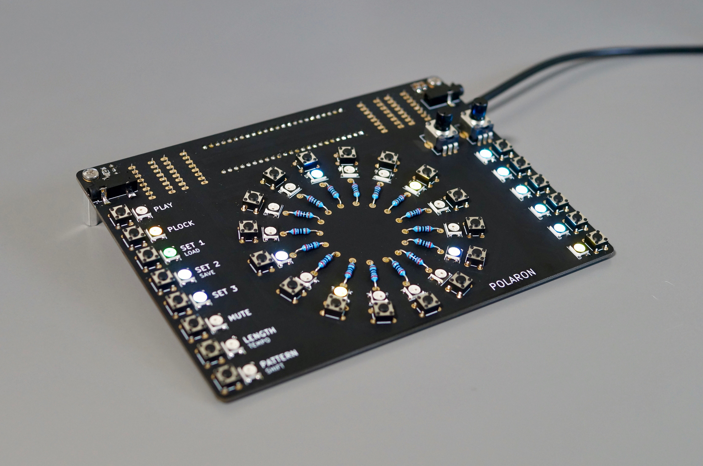
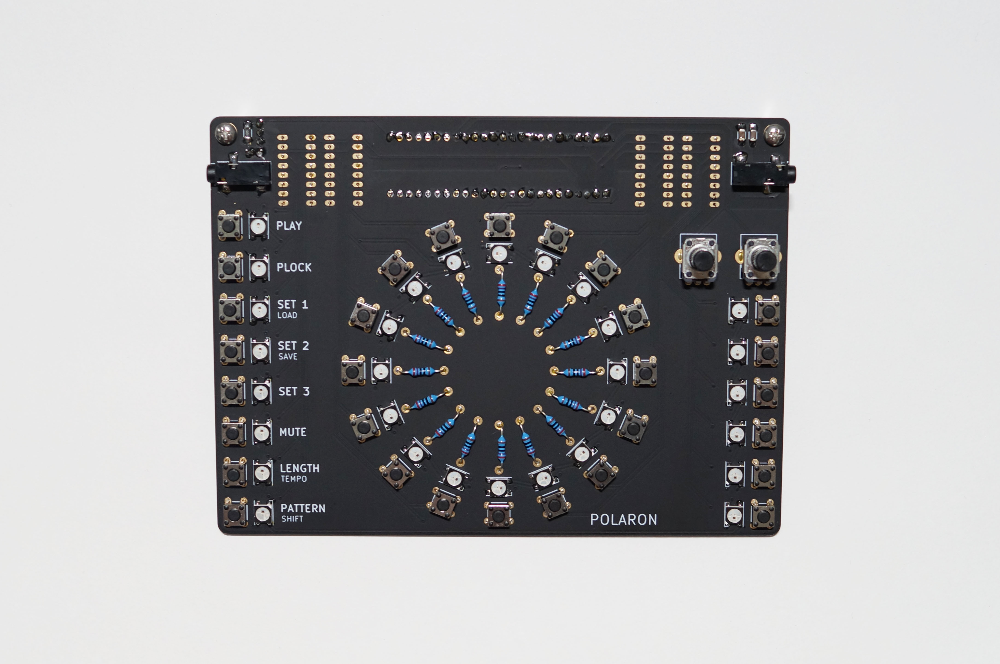
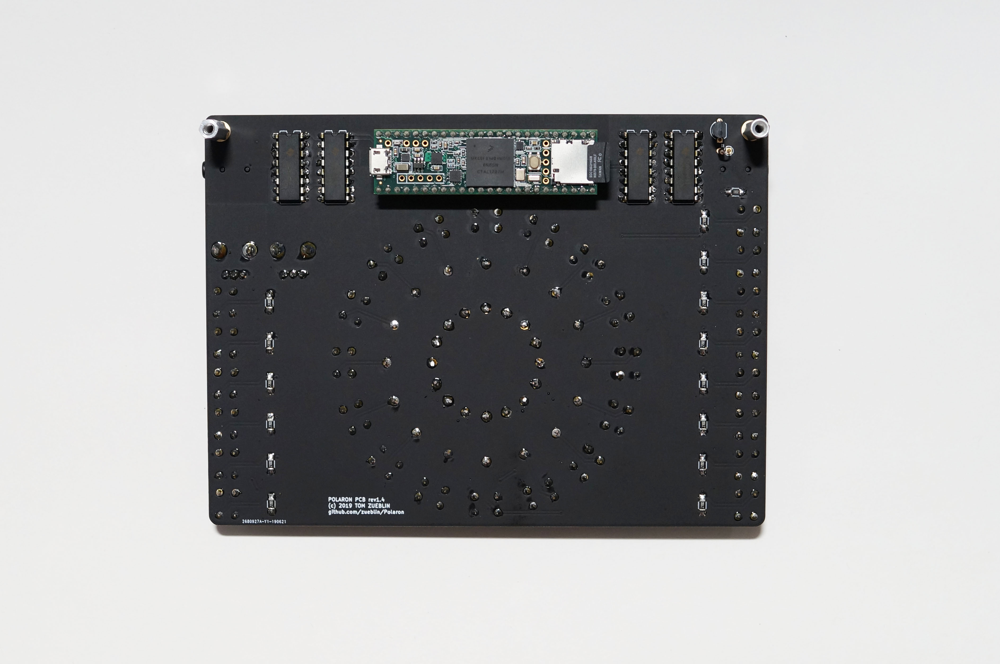
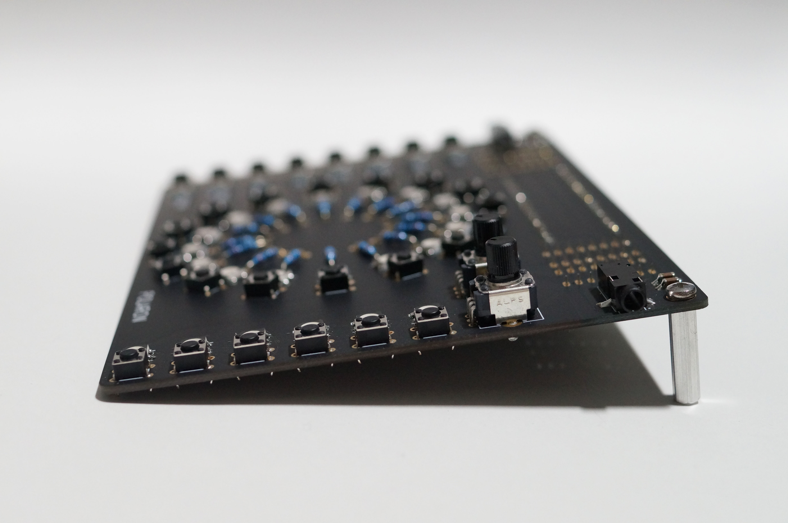

# Polaron

Polaron is a DIY digital drum machine based on the [Teensy 3.6](https://www.pjrc.com/teensy/) USB Microcontroller plattform.

Main features:

- 16 step sequencer
- 6 instrument tracks
- 16 patterns per track
- 2 pots for parameter control
- parameter locks: all instrument parameters can be recorded for each step
- different pattern length for each instrument track
- midi sync
- crunchy 12bit stereo outputs
- open source hardware/software: if you miss a feature or are annoyed by a bug... change it!

Disclaimer: This project is a work in progress. Features may change or not work, use at your own risk.

There's a short demo on vimeo:

https://vimeo.com/302283771

https://vimeo.com/305113707

And don't forget to check the [Project WIKI](https://github.com/zueblin/Polaron/wiki) for more info.

## Software

To build the software, the following tools are required:

- [Arduino IDE](https://www.arduino.cc/en/Main/Software) (tested with 1.8.6)
- [Teensyduino Add-On](https://www.pjrc.com/teensy/teensyduino.html) (tested with 1.43)

## Hardware

PCB is designed using KICAD 4.0.6

Parts needed (Rev 1.2):

- Teensy 3.6 32bit Microcontroller (with Headers)
- 30 x WS2812b RGB LEDs (or SK6812)
- 30 x 6x6mm Pushbuttons (ideally 4.3mm height, 100gf) (Mouser: 688-SKHHAJ)
- 30 x 270 ohm Resistors (Mouser: 603-MF0207FTE52-270R)
- 4 x SN74HC165N Shiftregister (Mouser: 595-SN74HC165N)
- 2 x ALPS Potentiometer (RK09K1130A8G)
- 2 x 2.2 uF SMD Capacitor (1206 housing, Mouser: 963-TMK316BJ225KL-T)
- 1 x Audio Jack (SJ-352X-SMT)
- 1 x 48 Position / 2 Row IC DIP Socket (Mouser: 517-4848-6004-CP)
- 2 x 20mm PCB Standoff with 3mm thread (Mouser: 534-24437)

Check the Wiki for [Build Instructions](https://github.com/zueblin/Polaron/wiki/Building-the-Polaron)

## Known Issues:
PCB Rev 1.2

- The Potentiometers need to be rotated 180 degress in the next revision, so that the marking on the potentiometers point upwards (away from the player) in middle position and not downwards (this has no impact on the functionality of the Polaron)
- In some situations, when connecting the polaron to a computer via usb and connecting the polaron audio output to an audio interface that is connected to the computer (e.g via thunderbolt), a ground loop is created. This results in a very noticable noise/whine in the audio channel (which is caused by the LED PWM). Tested solution: [Audio Ground Loop Noise Isolator](https://www.pjrc.com/store/audio_ground_isolator.html)

## FAQ

- Q: Is this an easy build? A: This is an intermediate project to build, its not particularly hard, but its not a good project if you've never soldered before. Most parts are easy to solder, but the LEDs are directly soldered onto the surface (SMD) of the PCB and you need to be careful not to overheat them. You'll also need a decent soldering iron to build this, with a fine tip.
- Q: Is this a pro audio project? A: No, not exactly. The Polaron is more about a fun workflow than super hifi sound.
- Q: Does it work with a Teensy 3.5? A: PJRC forum member drjohn reports successfully running the Polaron with a Teensy 3.5.
- Q: Is there a manual? A: Yes, please check the [Project WIKI](https://github.com/zueblin/Polaron/wiki) for build instructions and operating manual. If you still have questions / suggestions, please send me a mail.
- Q: Can i buy a PCB? A: Yes, i currently have Rev 1.2 PCBs at 25 USD incl. untracked international shipping. Add 5 USD for tracked shipping. Please send me a mail, if interested.
- Q: Can i buy a part-kit? A: Yes, i currently have part kits (Rev 1.2 PCB + all parts, EXCLUDING the teensy itself) at 60 USD incl. untracked international shipping. Add 5 USD for tracked shipping. Please send me a mail, if interested.
- Q: Can i buy a fully assembled Polaron? A: Not, not at the moment.

# License

Code: MIT

Hardware: cc-by-sa-3.0

By: Thomas Zueblin (thomas.zueblin@gmail.com)
